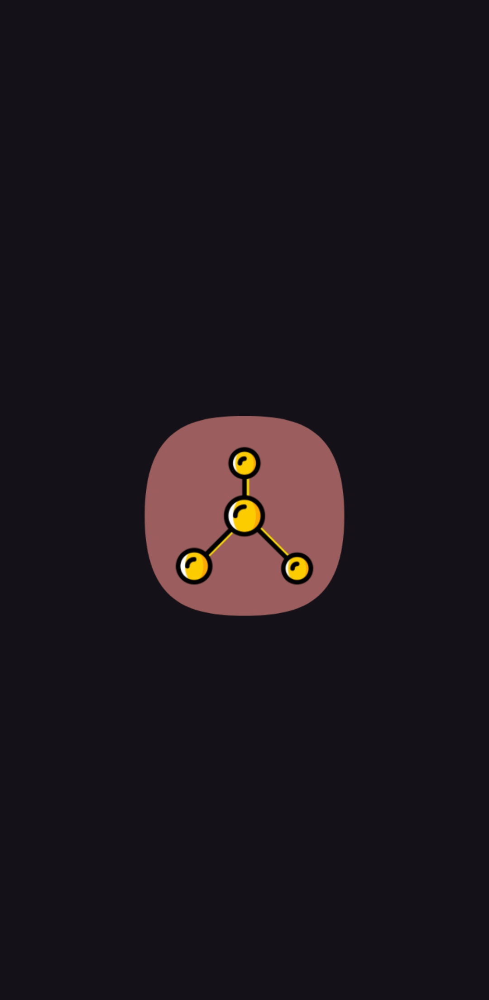

<!-- PROJECT LOGO -->
 

  

<h2 align="center">Endgame</h2>

    A comprehensive to-do app designed to help you manage your tasks efficiently. View your tasks daily, weekly, monthly, and yearly with an intuitive UI, and organize them within projects. Keep your data secure with offline functionality and export backups easily!
     

---

<!-- ABOUT THE APP -->
## About The App

Endgame is a powerful to-do application that provides a user-friendly interface to help you organize your tasks and projects. With a clear view of your tasks across different timeframes—daily, weekly, monthly, and yearly—Endgame ensures that you stay on top of your schedule and manage your time effectively. Additionally, the app supports a project system where tasks can be grouped into folders, allowing for detailed organization.

Key features include:
- **Intuitive Task Views**: View tasks by day, week, month, and year for better planning and time management.
- **Project Organization**: Add tasks within folders to keep your projects structured and organized.
- **Offline Functionality**: Endgame operates fully offline, ensuring your data remains private and secure.
- **CSV Backup**: Easily export your tasks and projects to CSV format for backups or external use.
- **Task Management UI**: A clear and easy-to-use interface to help you manage your tasks effectively.

  
  
  
 
 

---

<!-- DOWNLOAD -->
## Download

You can download the latest version of Endgame from the [Releases Page](https://github.com/illichtz/Endgame/releases/).

---

<!-- USAGE EXAMPLES -->
## Usage

Endgame is versatile and can be used in various scenarios:
- **Task Management**: Organize your tasks by day, week, month, or year to prioritize your workload.
- **Project Planning**: Group tasks within folders to manage larger projects efficiently.
- **Data Backup**: Export your tasks and projects to CSV format for backup or further use.

---

<!-- ROADMAP -->
## Roadmap

- [x] Task views for day, week, month, and year
- [x] Project system with tasks in folders
- [x] CSV backup functionality
- [ ] Dragging and sorting items
- [ ] Faster loading speeds
- [ ] Import backups
- [ ] Task counting inside folders

---

<!-- LICENSE -->
## License

Endgame is licensed under the GNU General Public License (GPL-3.0). You can find the license text in the LICENSE file.
